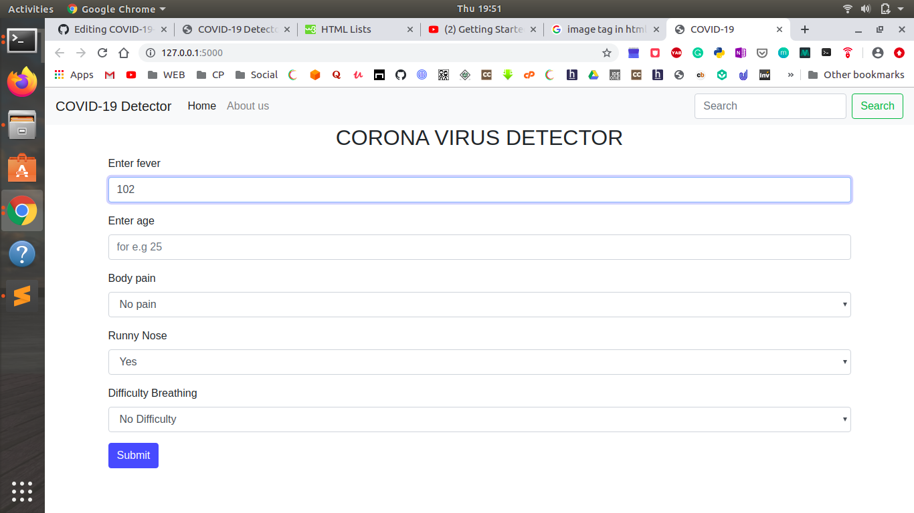

# COVID-19 Detector

This project is aimed to detect the probability of a person suffering from COVID-19. 
	
Team Name : NP-HARD  
Leader Name : soham patil  
Branch : Information Technology 
UID : 2017BTEIT00030  
Year : 3 (TY) </h3>

 
     <b> Tech stack used : Logistic Regression, Python, Flask, Bootstrap</b> 
 
 
This project is a web application which helps people to find their chances(probability) of having
covid-19. For this project purpose, I have created a dummy dataset to train my model.
 
 
If the model is trained using proper dataset then it can surely predict much better.
 
 

<h1> Motivation behind this Idea : </h1>	

<ul>
  <li>Understanding the current scenario spread due to covid-19 in our country of India where the ratio of medical facilities
per human is very less, pandemic disease can prove a major threat than any other thing.</li>
  <li>Also testing equipments are also very less so there is always a problem to decide the priority for testing for a disease.</li>
  <li>So what if theres a machine learning model which can help the people to check the chances of having covid-19 by entering 
thier symptoms.</li>
</ul>

<h1>How to run the application : </h1>

<h3> Step 1: </h3> clone this repository by entering the command : git clone https://github.com/codecsp/COVID-19-Detector.git DIR 
(Go to the DIR and ypu will the project files listed there)

<h3> Step 2: </h3> To execute this application, system must have flask installed.

to install flask, enter the command on your terminal : <b>  <i> pip install flask </b> </i>

<h3> Step 3: </h3>Execute the <b><i>main.py</i></b> file by just using the command python3 main.py
(Flask server will be generated and you will get an endpoint, copy that)

<h3> Step 4: </h3>Enter  the <b><i> url (endpoint) </b> </i> in your browser and you are ready to go.

<h3> Step 5: </h3>Enter the details based on the symptoms and you will your probability.

  
If you like this, considerit givig a star and I would be highly encouraged if you wish to contribute to this repository.

